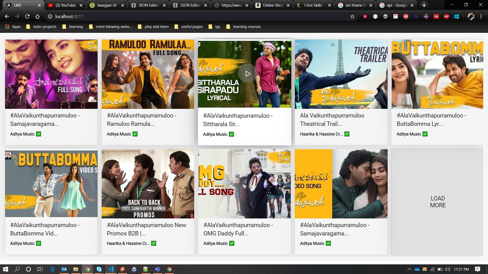

# Youtube Clone

This project was generated with [Angular CLI](https://github.com/angular/angular-cli) version 8.3.20.

## Development server

Run `npm i` for installing the required package files as per package.json.

## Development server

Run `ng serve` for a dev server. Navigate to `http://localhost:4200/`. The app will automatically reload if you change any of the source files.

## Build

Run `ng build` to build the project. The build artifacts will be stored in the `dist/` directory. Use the `--prod` flag for a production build.

## App Images

Home Page:

Home Page Loading:

Courses Page:

Video Page:

## Live Demo

You can file the live demo of the app in the above link and also <a href="https://youtube.pavanaditya.com" target="_">here</a>.

## Developer

Pavan Aditya M S <a href="https://pavanaditya.com" target="_">pavanaditya.com</a>

## Further help

To get more help on the above app you can contact me at pavanaditya.ms@gmail.com
